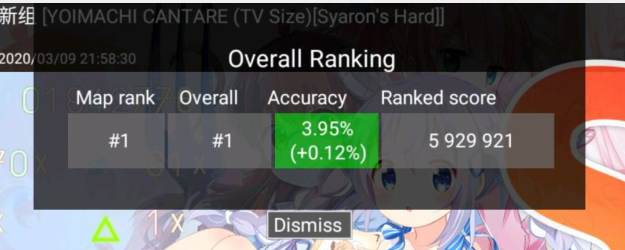
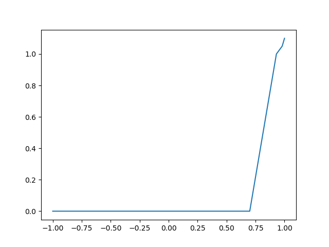
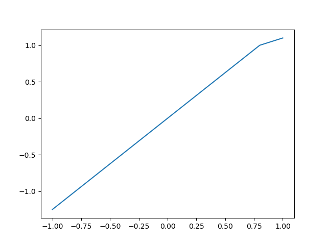

# 第一届osu!droid挑战赛
在这次比赛中，玩家游玩预先选好的赛图来获得 **挑战分**， 并通过 **挑战分** 来解锁不同等级的
徽章，以及参与全球总排名来获取排名奖励。  
这次比赛适合任何阶段的玩家参加，而且参赛方式十分简单。

## 参赛方式
下载特定的比赛图包并让osu!droid加载后，联网打图并上传成绩即视为参赛，  
无需任何的特殊操作。

## 比赛图包
总共30个谱面被分为了3个整合包，分别为萌新组，进阶组和挑战组，每组各10张图。
在进阶组和挑战组中各有3个图需要使用对应的mod，具体请看下面的mod部分。

## 比赛时间
比赛开始时间为： 北京时间 2020年3月14日 上午8:00
比赛结束时间为： 北京时间 2020年3月30日 上午8:00
持续16天。这个时间段内任何时候上传赛图的成绩都会被接受，
超过时间后就会被拒绝接受成绩。

## 如何查看自己的挑战分
加入比赛后可以在[挑战赛排行榜](http://ops.dgsrz.com/challenge_ranking.php)
看到全球排名以及搜索玩家的详细成绩，在网站[登录](http://ops.dgsrz.com/user/?action=login)后
就可以访问[个人主页](http://ops.dgsrz.com/challenge_profile.php)查看自己最近的成绩以及总挑战分以及排名等信息。

## 在osu!droid客户端上发生的一些改变
在挑战赛赛图内，上传成绩后弹出的用户数据会被替换为挑战赛专门的数据。  
  
图中的Accuracy（准确度）被替换为了你的 **挑战分**。  
  
全球排行榜上的Accuracy（准确度）也被替换为了这个成绩的 **挑战分**。
  
在谱面的难度名称里会有谱面的**挑战值**，规定的mod，以及谱面的名称。

## Mod的使用
除了**Half Time**这种降速mod，以及**Auto**这种不记录排名的mod以外，
我们允许随意搭配mod，唯一的例外就是如果这个谱面被规定了mod，那么你选取的mod里就必须包含
这个mod。
同时在计分时这些mod均不会带来额外的奖励，也不会降低你的奖励（也就是说mod对挑战分无影响）

小提示：**No Fail**不会降低你的分数，因此在尝试高难度的谱面时可以尝试使用**No Fail**
小提示：开始游戏时是不会提醒你有没有使用规定的mod的，没使用规定的mod的成绩是被拒绝接受的！


## 基础的计分方式
### 单次成绩的计算
本次比赛的每一个谱面都被人工的标定了一个**挑战值**，难度越高，**挑战值**越高。
玩家的每一个成绩都会依据这个**挑战值**来计算出对应的挑战分。  
你可以粗略的认为在达成93%的准确率以及在没有断连太多的时候拿到**100%**的**挑战值**对应的**挑战分**。
从这个对应了**100%挑战值**的成绩到SS（也就是说全部都是300判定，100%的准确率）
之间还有**10%挑战值**的额外挑战分奖励，成绩越好，额外得分越高。

如果你不关心这些分数具体是怎么计算的，那么你或许就可以跳过后面的这部分，
努力的挑战更好的成绩就是这个比赛的核心意义！

### 总挑战值的计算
**总挑战值** = 0.8倍**Best5** + 0.2倍**Recent10**
#### Best5
**Best5**表示你最好的5个成绩的平均分，每个谱面只记一次。

#### Recent10
**Recent10**粗略的表示你最近的10个成绩的平均分，允许出现同一个谱面的成绩。
有一点小规则来防止意外的差成绩导致的最近得分过低，
因此不需要担心打出了一个很糟糕的成绩而导致要重新刷10个最近成绩。

#### Recent10的具体计算方式
当你上传一个成绩时，如果你被记录的成绩还没有10个，那么你的这个成绩当然会必被记录下来。
如果你已经记录了超过十个成绩，那么就分两种情况来讨论：
* 如果你的 **准确率高于93%** 或者你游玩的谱面的 **挑战值的1.1倍**（谱面的最高**挑战分**）
都低于你的**Best5**，那么请放心，您的**Recent10**值绝对不会降低。我们会挑选出你 **Recent100** 成绩里
最差的那一个，如果你的成绩比这个最差的还低，那么你这次的成绩将不会更新你的**Recent10**，
如果你的新成绩比这个最差的要好，那么我们会用新成绩替换掉这个最差的成绩。
* 如果你的成绩不满足上面的条件，那么将会按照时间顺序把最早记录的成绩移出**Recent10**，
并插入新成绩，如果你的新成绩不够好，那么你的**总挑战分**有可能会降低。

## 奖励
奖励分为两种，第一种奖励通过达成一定的**挑战分**来获得，对应下面的表格：

| 徽章名称 | 所需挑战分 |
|-----------|-------|
|萌新组(-)   |3.0   |
|萌新组(=)   |3.8   |
|萌新组(+)   |4.3   |
|进阶组(-)   |5.2   |
|进阶组(=)   |5.9   |
|进阶组(+)   |6.3   |
|挑战组(-)   |6.8   |
|挑战组(=)   |7.3   |
|挑战组(+)   |7.8   |

在未来的个人主页上可以看到你所获得的徽章。

第二种奖励是总排行榜的奖励，[挑战分排行榜](http://ops.dgsrz.com/challenge_ranking.php)前三的会有特殊奖励。

## 单次成绩的具体计算方式
如果你对这个感兴趣，我默认你将会理解下面的一些符号计算。

**单次成绩挑战分** = **谱面挑战值** x (0.8 x **accPt** + 0.2 x **comboPt**)

对应的几个值的计算方式如下：

**accRate**：就是你的准确率，在0~1之间取值。  
**comboRate**：等于 **你的分数** / **Auto打出SS时候的成绩**，也是在0~1之间取值。

**accPt**：在 **accRate**=0.7时取值为0，在 **accRate** 取值为0.93时取值为1，
在 **accRate**=0.98时取值为1.05，在**accRate**=1.0时取值为1.1，其他的值均为这些相邻节点的线性插值。  
具体的计算公式为：
```python
if accRate < 0.7:
    accPt = 0
elif accRate < 0.93:
    accPt = (accRate - 0.7) / 0.23
elif accRate <  0.98:
    accPt = 1 + 0.05 * (accRate - 0.93) / 0.05
else:
    accPt = 1.05 + 0.05 * (accRate - 0.98) / 0.02
```
我们画了一张图来描述**accPt**和**accRate**的关系：  


**comboPt**：类似**accPt**，在**comboRate**=0时**comboPt**=0，在**comboRate**=0.8时**comboPt**=1，
在**comboRate**=1时**comboPt**=1.1。  
具体的计算公式为：
```python
if comboRate < 0.8:
    comboPt = comboRate / 0.8
else:
    comboPt = 1 + 0.1 * (comboRate - 0.8) / 0.2
```
我们同样画了一张图来描述**accPt**和**accRate**的关系：  
